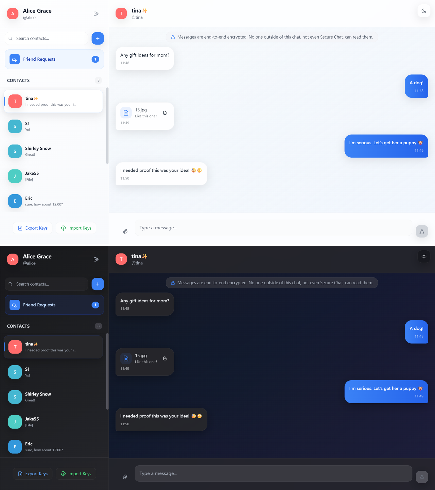

# SecureChat

A simple, full-stack secure messaging application featuring **end-to-end encryption (E2EE)**. SecureChat ensures that only you and your friends can read your messages—no one else, not even the server.

## Project Overview

SecureChat is designed for privacy-first, real-time communication. It leverages strong cryptography in the browser and on the backend, with all encryption and decryption performed on the client side. The server never has access to your private keys or plaintext messages.

- **Frontend:** Vue 3 + Vite + Tailwind CSS, with cryptography powered by [libsodium-wrappers](https://github.com/jedisct1/libsodium).
- **Backend:** Spring Boot 3 (Java 17), RESTful API, JWT authentication, and WebSocket for real-time messaging.
- **Database:** PostgreSQL (for user and message metadata).

## Demo



---

## End-to-End Encryption (E2EE) Design

### Key Architecture

- **Key Generation:**  
  - On registration, each user generates two key pairs in the browser:
    - **Ed25519**: For digital signatures (reserved for future use).
    - **X25519**: For ECDH key agreement (session key negotiation).
  - **Public keys** are uploaded to the backend.  
  - **Private keys** are stored only in the browser (localStorage) and never leave the client.

- **Key Exchange:**  
  - When starting a chat, the frontend fetches the peer's X25519 public key.
  - Both sides use their X25519 private key and the peer's public key to derive a **shared session key** using ECDH:
    ```js
    sessionKey = sodium.crypto_scalarmult(myPrivateKey, theirPublicKey)
    ```
  - All keys are encoded in base64url.

### Message Encryption

- **Algorithm:**  
  - Uses **ChaCha20-Poly1305** (via libsodium's `crypto_aead_chacha20poly1305_ietf`).
- **Process:**  
  1. For each message, generate a random 12-byte nonce:
     ```js
     const nonce = sodium.randombytes_buf(sodium.crypto_aead_chacha20poly1305_ietf_NPUBBYTES)
     ```
  2. Encrypt the plaintext with the session key and nonce:
     ```js
     const cipher = sodium.crypto_aead_chacha20poly1305_ietf_encrypt(
       sodium.from_string(plainText),
       null, null, nonce, sessionKey
     )
     ```
  3. Send the ciphertext and nonce (both base64url) to the backend.
- **Decryption:**  
  - The recipient uses the same session key and nonce to decrypt:
    ```js
    const plain = sodium.crypto_aead_chacha20poly1305_ietf_decrypt(
      null, cipher, null, nonce, sessionKey
    )
    ```

### Security Model

- **Private keys** never leave the client; the backend cannot decrypt any message.
- **Session keys** are derived per friend, allowing both parties to decrypt all historical messages.
- **Nonces** ensure each message is uniquely encrypted, preventing replay attacks.
- **Ed25519** keys are reserved for future message signing and verification.

### API & Data Flow

- **Send Message:**  
  - `POST /api/messages` with fields: `receiverUsername`, `encryptedContent`, `nonce`, `messageType`, and (for files) `fileUrl`, `originalFilename`.
- **Fetch Messages:**  
  - `GET /api/messages/{otherUsername}` returns encrypted messages and metadata.
- **WebSocket:**  
  - Real-time message delivery using Spring WebSocket, with all payloads encrypted.

---

## Frontend Cryptography Dependency

SecureChat uses the following cryptography library in the frontend:

- [`libsodium-wrappers`](https://github.com/jedisct1/libsodium)  
  - Version: ^0.7.15  
  - Provides robust, audited cryptographic primitives for key generation, ECDH, and authenticated encryption.

**Other major frontend dependencies:**
- Vue 3, Pinia, Axios, @stomp/stompjs, Tailwind CSS

---

## Deployment Guide

This project is configured for easy deployment using Docker.

### Prerequisites

- **Docker** and **Docker Compose**
- **Git** (for cloning the repository)

### 1. Clone the Repository

```bash
git clone https://github.com/your-repository/securechat.git
cd securechat
```

### 2. Configure Environment Variables

Create a `.env` file in the root directory by copying the example file:
```bash
cp env.example .env
```
Review and adjust the variables in `.env` as needed. The default values are suitable for a local development environment.

### 3. Run with Docker Compose

Build and start all services (frontend, backend, database) in detached mode:
```bash
docker-compose up --build -d
```
The application will be available at `http://localhost`.

- The **frontend** is served on port `80`.
- The **backend** API is available on port `8080`.
- **PostgreSQL** database runs on port `5432`.

### 4. Stop the Application

To stop the services, run:
```bash
docker-compose down
```

### (Optional) Local Development without Docker

If you prefer to run the services locally without Docker:

#### Prerequisites
- **Backend:** JDK 17+, Maven, PostgreSQL
- **Frontend:** Node.js 18+, npm

#### Backend Setup
1.  Configure your PostgreSQL database connection in `src/main/resources/application.properties`.
2.  Build and run the Spring Boot application:
    ```bash
    # From the root directory
    mvn spring-boot:run
    ```

#### Frontend Setup
1.  Navigate to the frontend directory:
    ```bash
    cd securechat-frontend
    ```
2.  Install dependencies and start the development server:
    ```bash
    npm install
    npm run dev
    ```
The frontend will be accessible at `http://localhost:5173`.

---

## License

This project is licensed under the MIT License.  
Cryptography powered by [libsodium](https://github.com/jedisct1/libsodium).
